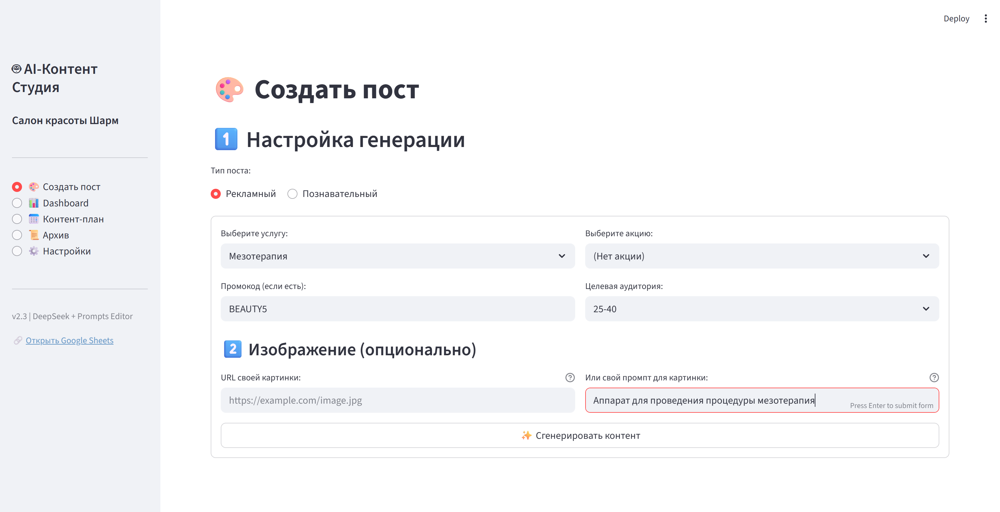
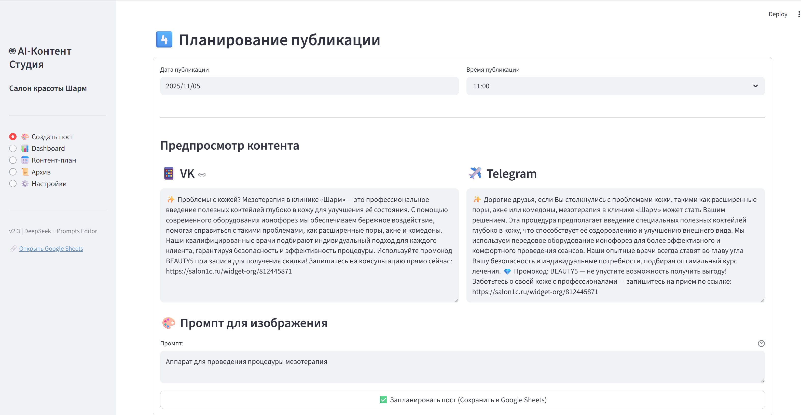
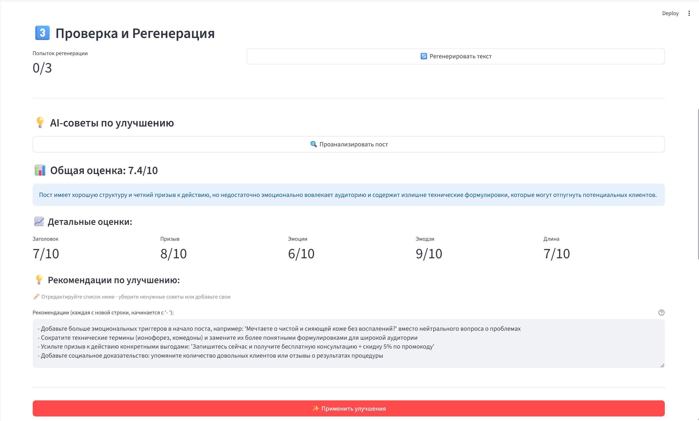
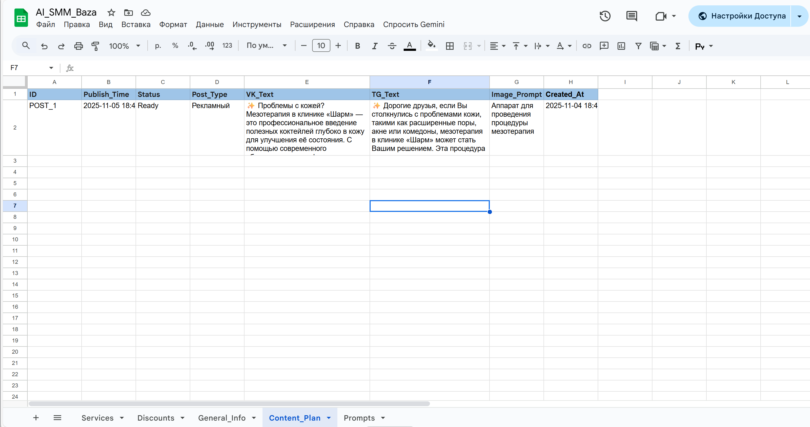
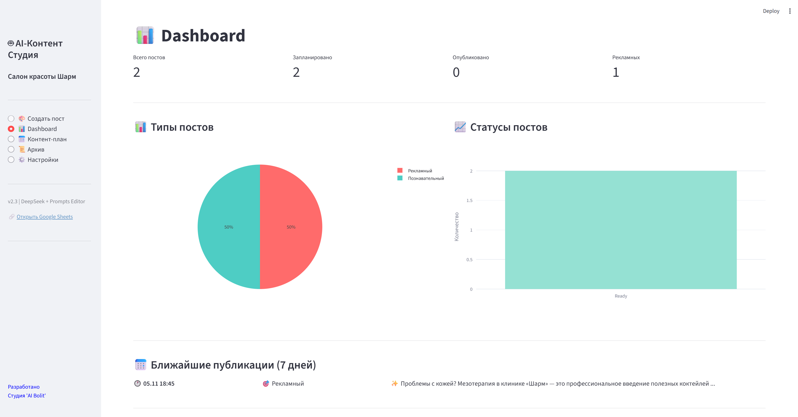
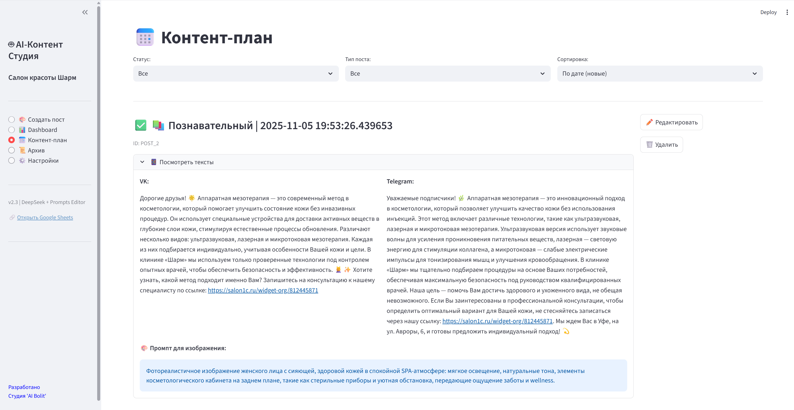
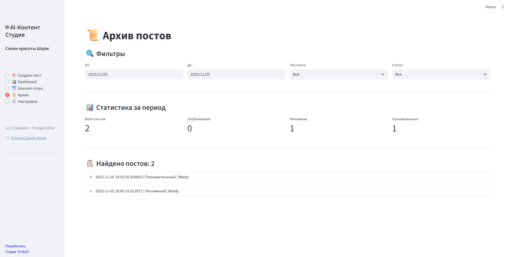
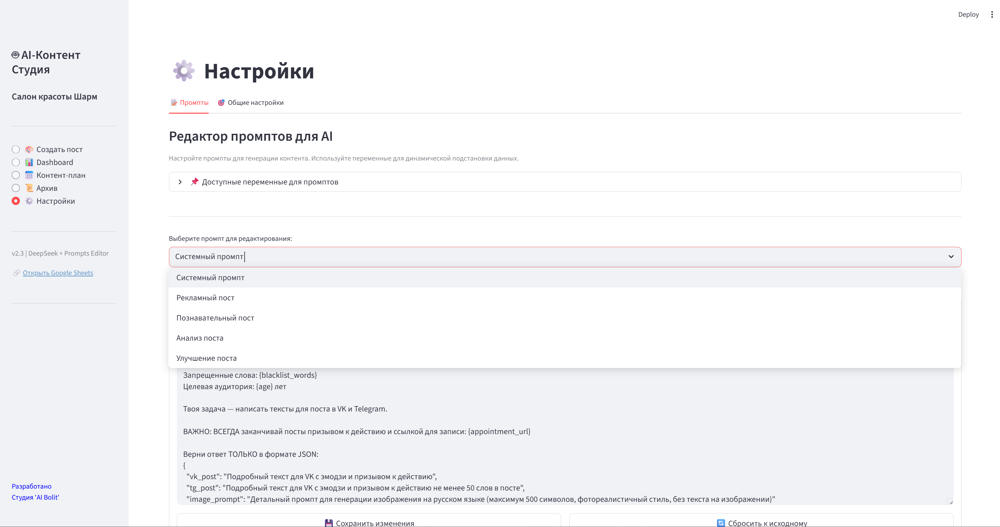
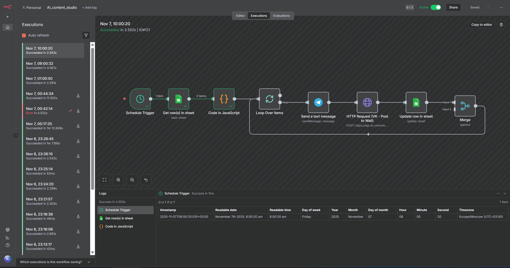

# 🤖 AI Content Studio

**Автоматизированная система создания контента для салонов красоты**

AI Content Studio — это веб-приложение на базе Streamlit для автоматической генерации постов в VK и Telegram с использованием DeepSeek AI. Разработано специально для салона красоты "Шарм".

[](https://streamlit.io)
[](https://www.python.org)
[](LICENSE)

---

## ✨ Возможности

### 📝 Генерация контента

- ✅ **Рекламные посты** — автоматическое создание постов об услугах и акциях
- ✅ **Познавательные посты** — образовательный контент для аудитории
- ✅ **AI-анализ** — оценка качества постов по 5 критериям с рекомендациями
- ✅ **Умные улучшения** — автоматическая доработка постов по советам AI
- ✅ **Промокоды** — автоматическое внедрение промокодов в тексты

### 🎨 Работа с изображениями

- ✅ Сохранение промптов для изображений (генерация через N8N опционально)
- ✅ Поддержка кастомных URL картинок

### 📊 Управление контентом

- ✅ **Dashboard** — статистика и аналитика постов
- ✅ **Контент-план** — планирование публикаций с календарем
- ✅ **Архив** — история всех постов с фильтрами
- ✅ **Редактор промптов** — настройка AI без программирования

### ⚙️ Гибкая настройка

- ✅ Редактируемые промпты через веб-интерфейс
- ✅ Настройка tone-of-voice и стиля общения
- ✅ Управление через Google Sheets
- ✅ Автопубликация текстовых постов (VK + Telegram)
- ⚙️ Опционально: генерация изображений через N8N

---

## 🚀 Быстрый старт

### Требования

- Python 3.9+
- Google Cloud аккаунт (для Google Sheets API)
- DeepSeek API ключ
- Docker Desktop (для N8N, опционально)

### Установка

```bash
# 1. Клонируй репозиторий
git clone https://github.com/your-username/ai-content-studio.git
cd ai-content-studio

# 2. Создай виртуальное окружение
python -m venv venv
source venv/bin/activate  # Linux/Mac
# или
venv\Scripts\activate     # Windows

# 3. Установи зависимости
pip install -r requirements.txt

# 4. Настрой конфигурацию
cp credentials.json.example credentials.json
cp .streamlit/secrets.toml.example .streamlit/secrets.toml

# 5. Заполни credentials.json и secrets.toml (см. docs/INSTALLATION.md)

# 6. Запусти приложение
streamlit run app.py
```

Приложение откроется по адресу: **http://localhost:8501**

---

## 📚 Документация

- 📖 [**Инструкция по установке**](docs/INSTALLATION.md) — подробная настройка с нуля
- 👩‍💼 [**Руководство пользователя**](docs/USER_GUIDE.md) — как работать с приложением
- 🔧 [**Настройка N8N**](docs/N8N_SETUP.md) — автоматическая публикация постов
- 📊 [**Структура Google Sheets**](google_sheets/sheets_structure.md) — описание таблиц

---

## 🎯 Основные функции

### 1️⃣ Создание поста

```
Выбор типа → Настройка параметров → Генерация AI → 
→ Анализ и улучшение → Планирование → Сохранение
```

**Типы постов:**

- **Рекламный** — услуга + акция + промокод
- **Познавательный** — образовательный контент

### 2️⃣ AI-анализ постов

Система оценивает:

- 📌 Привлекательность заголовка (1-10)
- 🎯 Силу призыва к действию (1-10)
- 💖 Эмоциональную вовлеченность (1-10)
- 😊 Использование эмодзи (1-10)
- 📏 Оптимальность длины (1-10)

### 3️⃣ Редактор промптов

Настраивайте промпты через веб-интерфейс с использованием переменных:

```
{service_name} — название услуги
{promo_code} — промокод
{tone_of_voice} — стиль общения
{age} — целевая аудитория
... и другие
```

---

## 🗂️ Структура Google Sheets

Приложение работает с Google Таблицей, содержащей листы:

| Лист             | Описание                                |
| ---------------- | --------------------------------------- |
| **Services**     | Список услуг салона                     |
| **Discounts**    | Акции и специальные предложения         |
| **General_Info** | Общие настройки (адрес, tone-of-voice)  |
| **Content_Plan** | Контент-план с запланированными постами |
| **Prompts**      | Промпты для AI-генерации                |

---

## 🔐 Безопасность

⚠️ **Важно!** Никогда не публикуйте в репозиторий:

- `credentials.json` — учетные данные Google
- `.streamlit/secrets.toml` — API ключи
- Любые токены и пароли

Эти файлы добавлены в `.gitignore`.

---

## 🛠️ Технологический стек

- **Frontend:** Streamlit 1.50.0
- **AI:** DeepSeek API (deepseek-chat)
- **Database:** Google Sheets (via gspread)
- **Visualization:** Plotly 6.3.1
- **Automation:** N8N (опционально)
- **Image Generation:** YandexART (через N8N)

---

## 📈 Roadmap

- [ ] Интеграция с Instagram API
- [ ] Мультиязычная поддержка
- [ ] A/B тестирование постов
- [ ] Статистика эффективности
- [ ] Шаблоны постов
- [ ] Массовое планирование

---

## 🤝 Поддержка

Если у вас возникли вопросы или проблемы:

1. 📖 Проверьте [документацию](docs/)
2. 🐛 Создайте [Issue](https://github.com/your-username/ai-content-studio/issues)
3. 💬 Напишите разработчику

---

## 📄 Лицензия

Этот проект распространяется под лицензией MIT. См. файл [LICENSE](LICENSE) для деталей.

---

## 👏 Благодарности

- [Streamlit](https://streamlit.io/) — за отличный фреймворк
- [DeepSeek](https://www.deepseek.com/) — за почти бесплатный AI, которого на тесте не жалел.
- [Google Sheets API](https://developers.google.com/sheets) — за удобное хранилище данных
- [N8N](https://n8n.io/) — за платформу автоматизации

---

## 📸 Скриншоты

<details>
<summary>🎨 Создание поста</summary>






</details>

<details>
<summary>📊 Dashboard</summary>



</details>

<details>
<summary>📊 Контент-план</summary>



</details>

<details>
<summary>📊 Архив</summary>



</details>

<details>
<summary>⚙️ Настройки</summary>



</details>


<details>
<summary>⚙️ n8n Автоматизация</summary>



</details>
---

**Сделано с ❤️ для салона красоты "Шарм"**
